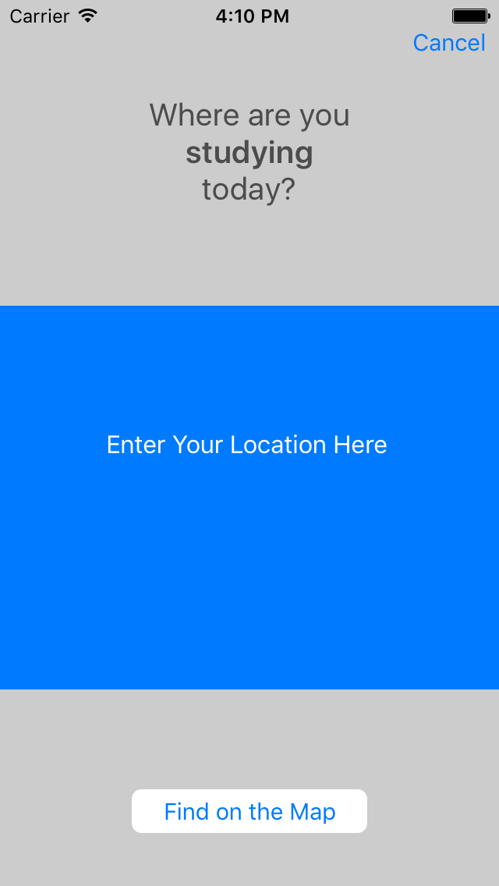

# On the Map
On the Map is an iOS app that lets you share a location and webpage with other Udacity students from around the world.

This app is a portfolio project from Udacity's "iOS Networking with Swift" course.

Both Udacity and Facebook account logins are supported.

Logging in brings the user to a map showing where students have already placed pins.

Tapping a pin displays the student's name and the webpage they provided. Clicking the popup opens a browser to the URL.

Student locations can also be viewed in a list format. Tapping a student's name opens the linked URL.

From either the map or the list the user has access to buttons for logging out, adding a new pin, and getting the most up-to-date student locations.

If a student location is already posted for the user, the app will ask if you want to overwrite it:

When creating a new location, the app will geocode the location into a coordinate on the map.

Then the user specifies the URL and submits the new entry.

